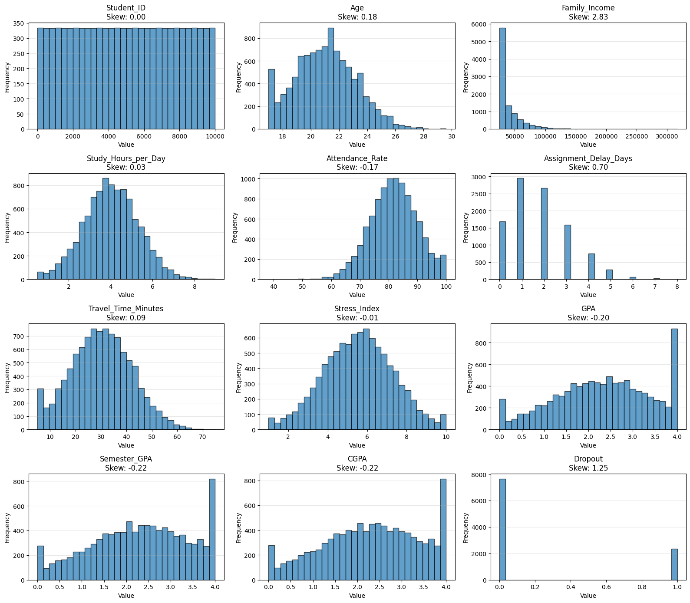

# Beyond Demographics: Identifying Academically At-Risk Students

This repository contains the research data and implementation for a machine learning framework designed to predict university student dropouts. The study focuses on addressing class imbalance using **SMOTE** and ensuring model transparency through **SHAP** interpretability.

## 📌 Project Overview
Student dropout is a critical challenge in higher education. This research evaluates four classification algorithms—**Logistic Regression, Random Forest, XGBoost, and Artificial Neural Networks (ANN)**—to identify students at risk.

### Key Features
* **Data Balancing:** Implementation of Synthetic Minority Oversampling Technique (SMOTE).
* **Explainable AI (XAI):** Utilization of SHAP values to explain individual predictions and feature importance.
* **Comparative Analysis:** Evaluation of models across Accuracy, F1-Score, Recall, and ROC AUC.

---

## 📂 Repository Contents
* **`Student_dropout_prediction.ipynb`**: Full Python implementation (Data preprocessing, SMOTE, Training, and SHAP analysis).
* **`WJAETS-2026-0192 (2).pdf`**: The official research paper published in the *World Journal of Advanced Engineering Technology and Sciences*.
* **`prediction_image.png`**: Visual representation of model performance and SHAP feature importance.

---

## 📊 Key Results
The study highlights that balancing the dataset significantly improves the **Recall** for the minority class (dropout students). 

| Model | Dataset | Accuracy | Recall | ROC AUC |
| :--- | :--- | :--- | :--- | :--- |
| **Logistic Regression** | Unbalanced | 0.8120 | 0.3992 | 0.8206 |
| **Logistic Regression** | **Balanced (SMOTE)** | 0.7420 | **0.7537** | 0.8188 |
| **Random Forest** | Balanced (SMOTE) | 0.7805 | 0.5669 | 0.7897 |

---

## 🖼️ Model Interpretability
Below is the SHAP/Prediction visualization generated during the analysis:

---

## 🛠️ Requirements
To run the notebook, you will need:
* Python 3.x
* `scikit-learn`
* `imbalanced-learn`
* `xgboost`
* `shap`
* `pandas`, `numpy`, `matplotlib`
